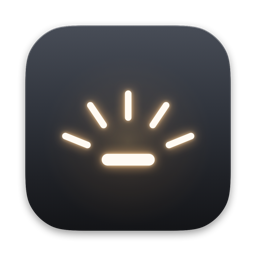
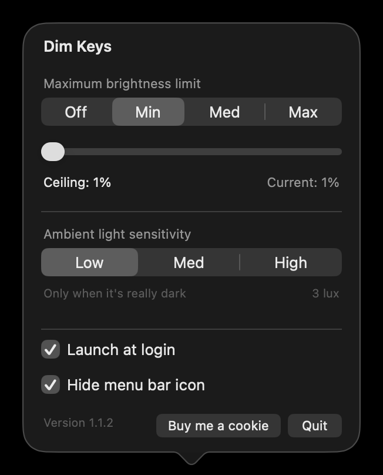

<p align="center">
  
</p>

<h1 align="center">Dim Keys</h1>

<p align="center">
  <b>Keyboard backlight limiter for MacBook.</b><br>
  A menu-bar app that caps how bright your keyboard backlight can get,
  and decides when it comes on from the ambient light sensor.
</p>

<p align="center">
  
</p>

## Why

macOS gives you a keyboard backlight slider and an auto-brightness checkbox, and
nothing in between. You cannot tell it *how eager* to be. In a dim room it often
lights the keys brighter than you want, and in normal room light it suppresses
them entirely even when you would rather have a faint glow.

This app gives you the two controls that are actually missing: a **ceiling** the
backlight will never exceed, and a **sensitivity** that decides how dark it has
to get before the keys light up at all.

## Install

1. Download the `.dmg` from [Releases](https://github.com/dmartoon/MacBook-Keyboard-Backlight-Limiter/releases/latest)
2. Drag **Dim Keys** into **Applications**
3. Open it — it appears in the menu bar, not the Dock

Moving it to `/Applications` matters if you use **Launch at login**: macOS
registers the login item at whatever path the app is sitting in, so leaving it
in `~/Downloads` means the login item breaks the moment you tidy up.

The app is signed with a Developer ID and notarized by Apple, so it opens
normally. A build you compiled yourself is unsigned and Gatekeeper will block
it — allow it under System Settings › Privacy & Security.

## Settings

**Maximum brightness limit** — the ceiling the backlight will never exceed.

| | |
|---|---|
| **Off** | Keys stay dark at every light level |
| **Min** | The dimmest the hardware can light without being off |
| **Med** | 35% |
| **Max** | No cap |

The slider sets any ceiling between the dimmest lit state and full. It is
disabled while **Off** is selected, since a maximum brightness means nothing
when the keys are held dark.

**Ambient light sensitivity** — how dark it must be before the keys come on.

| | Comes on below | Goes off at |
|---|---|---|
| **Low** | 7 lux — effectively an unlit room | 10 lux |
| **Med** | 48 lux — a dimly lit room | 60 lux |
| **High** | 120 lux — normal room light | 150 lux |

The gap between the two numbers is deliberate. Ambient readings jitter by
several lux, and without it the keys would blink on and off at the boundary.

**High is more eager than macOS itself.** It will light the keys in ordinary
room light, where stock macOS suppresses them completely.

## How it works

The app reads the ambient light sensor once a second and computes the whole
brightness curve itself, then writes the result.

It computes the *whole* curve rather than just clamping macOS's value because it
has to. Writing the keyboard brightness property is treated by macOS as a manual
override — exactly like dragging the System Settings slider — and it permanently
disengages macOS's own auto-brightness. So a limiter that only clamps when the
value is too high would break the ambient response the first time it fired, and
nothing would ever raise the backlight again.

One consequence: after you quit, macOS does not resume driving the backlight.
The app therefore hands back a plainly lit keyboard on the way out rather than
leaving you with dark keys. Pressing F5/F6 re-engages macOS's own control.

## Updates

The app checks GitHub for a newer release at launch, every six hours, and
whenever you open the panel — at most one request an hour. If there is one, the
version in the corner of the panel becomes a link to the release page, and you
get a notification, so the news still reaches you when the menu bar icon is
hidden or you simply have not opened the panel in weeks. macOS asks for
notification permission the first time there is actually something to tell you,
and each release is announced once.

It only ever asks GitHub what the latest release tag is — nothing about you or
your machine is sent, and nothing is installed automatically. If the check fails
for any reason it stays silent.

## Requirements

- Apple Silicon or Intel (the app ships universal)
- macOS 13 or later — but everything has only been developed and verified on
  macOS 26, so anything earlier is genuinely untested. The app talks to a
  private framework; if that framework differs on your version, it does not
  misbehave, it just reports that no keyboard backlight was found. If that
  happens, please open an issue and say which macOS version you are on.
- A MacBook with a backlit keyboard and an ambient light sensor.

## Building from source

```bash
git clone https://github.com/dmartoon/MacBook-Keyboard-Backlight-Limiter.git
cd MacBook-Keyboard-Backlight-Limiter
./build-app.sh
open "build/Dim Keys.app"
```

`release.sh` produces the distributable build instead — universal, Developer ID
signed with Hardened Runtime, notarized and stapled. It needs a Developer ID
certificate and stored notarization credentials.

## Known limitations

- **It uses a private framework.** There is no public API for keyboard backlight
  control on macOS at all — `BrightnessSystemClient` is the only write path that
  reaches the hardware from an unprivileged process. A future macOS release
  could rename or remove it, in which case the app fails safely rather than
  misbehaving.
- **Not distributable on the Mac App Store**, for the same reason.
- Hiding the menu bar icon leaves the app running. Opening the app again brings
  the icon back — that is the only way to reach the settings afterwards.

## License

MIT — see [LICENSE](LICENSE).
